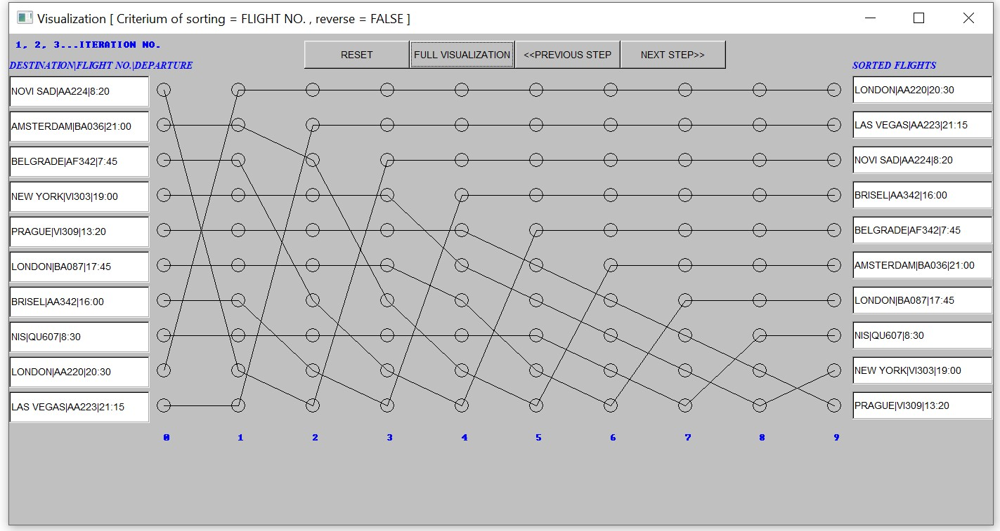

# sorting-flights
This project is school assignment for intro to C++ course based on this [book](https://www.stroustrup.com/programming.html) from profesor Stroustrup. The project is done in **visual studio**  with **fltk library** for gui.

## Two modes

#### Command line arguments
You have to specify this parametars in this order:  
- inputFileName (contains flights you want to sort)
- outputFileName (return sorted flights with additional information)
- algorithm ('s' for selectionSort and 'm' for mergeSort)
- criterium:
   1. 'd' - destination,
   2. 't'  -departure time,
   3. 'fn' - flight number,
   4. 'gn' - gate number
- reverse (0 for increasing sort, and 1 for decreasing)
#### GUI

## Visualization
If inputed arguments are valid, visualization will start. You can track positions of each element through iterations. For example, here is example for selecetion sort algorithm:

 

and corresponding input and output files after sorting    

